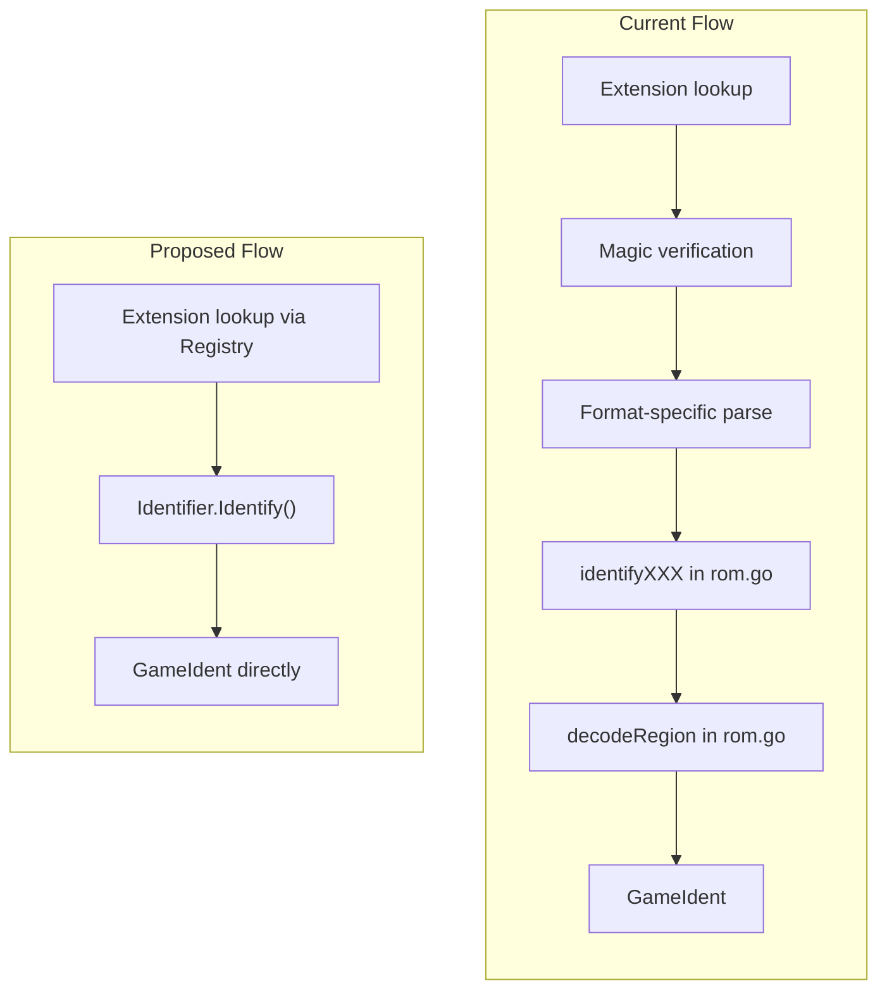

# Refactor romident to Use Centralized Format Registry

## Current Problem

Adding a new format requires edits in multiple places:

1. `detect.go` - extension mapping and magic verification
2. `game/XXX/XXX.go` - platform-specific parser returning `XXXInfo` struct
3. `rom.go` - `identifyXXX()` function to convert to `GameIdent`, plus region decoder

## Proposed Architecture



## Key Changes

### 1. New Registry File: `lib/romident/game/registry.go`

Central registration of all formats with their extensions:

```go
type FormatEntry struct {
    Format     Format
    Extensions []string
    Identifier GameIdentifier
}

var Registry = []FormatEntry{
    {FormatGBA, []string{".gba"}, &gba.Identifier{}},
    {FormatNDS, []string{".nds", ".dsi", ".ids"}, &nds.Identifier{}},
    // ... all formats
}

func IdentifiersByExtension(ext string) []GameIdentifier { ... }
```

### 2. Each Format Implements `GameIdentifier` Directly

Example for GBA (`lib/romident/game/gba/gba.go`):

```go
type Identifier struct{}

func (i *Identifier) Identify(r io.ReaderAt, size int64) (*game.GameIdent, error) {
    // 1. Verify format (check magic byte 0x96 at offset 0xB2)
    // 2. Parse header into internal GBAInfo
    // 3. Convert to GameIdent with region decoding inline
    // 4. Return GameIdent directly (not GBAInfo)
}
```

The `ParseGBA()` function and `GBAInfo` struct can remain as internal helpers, but the public API is just `Identify()`.

### 3. Simplify `lib/romident/rom.go`

Remove:

- All `identifyXXX()` functions (~20 functions)
- All `decodeXXXRegion()` functions (~8 functions)
- Repetitive format-specific blocks in `identifySingleReader()`

Replace with:

```go
func identifyGame(r io.ReaderAt, size int64, filename string) (*GameIdent, Format, error) {
    ext := strings.ToLower(filepath.Ext(filename))
    for _, entry := range game.Registry {
        if !hasExtension(entry.Extensions, ext) {
            continue
        }
        ident, err := entry.Identifier.Identify(r, size)
        if err == nil {
            return ident, entry.Format, nil
        }
        // Try next candidate (rare - most extensions map to one format)
    }
    return nil, FormatUnknown, nil
}
```

### 4. Simplify `lib/romident/detect.go`

The `Detector` can be simplified since format verification is now part of each identifier. We may keep it for non-game formats (CHD, ZIP, ISO9660) or for cases where we only need format detection without identification.

## Files to Modify

| File | Changes |

| ------------------------------------------------------------------ | -------------------------------------------- |

| [`lib/romident/game/types.go`](lib/romident/game/types.go) | Already has interface; add `Format` type |

| `lib/romident/game/registry.go` | **New file** - centralized registration |

| [`lib/romident/game/gba/gba.go`](lib/romident/game/gba/gba.go) | Add `Identifier` type implementing interface |

| [`lib/romident/game/nds/nds.go`](lib/romident/game/nds/nds.go) | Add `Identifier` type implementing interface |

| [`lib/romident/game/nes/nes.go`](lib/romident/game/nes/nes.go) | Add `Identifier` type implementing interface |

| [`lib/romident/game/snes/snes.go`](lib/romident/game/snes/snes.go) | Add `Identifier` type implementing interface |

| [`lib/romident/game/gb/gb.go`](lib/romident/game/gb/gb.go) | Add `Identifier` type implementing interface |

| [`lib/romident/game/n64/n64.go`](lib/romident/game/n64/n64.go) | Add `Identifier` type implementing interface |

| [`lib/romident/game/md/md.go`](lib/romident/game/md/md.go) | Add `Identifier` type implementing interface |

| [`lib/romident/game/md/smd.go`](lib/romident/game/md/smd.go) | Add `Identifier` type implementing interface |

| [`lib/romident/game/xbox/xiso.go`](lib/romident/game/xbox/xiso.go) | Add `Identifier` type implementing interface |

| [`lib/romident/game/xbox/xbe.go`](lib/romident/game/xbox/xbe.go) | Add `Identifier` type implementing interface |

| [`lib/romident/rom.go`](lib/romident/rom.go) | Remove ~28 functions, use registry |

| [`lib/romident/detect.go`](lib/romident/detect.go) | Simplify or delegate to registry |

| `lib/romident/test/identify_test.go` | **New file** - integration tests |

| [`lib/romident/rom_test.go`](lib/romident/rom_test.go) | **Move** to test/ and expand |

| `lib/romident/game/*/_test.go` | **Delete** - replaced by integration tests |

## Testing Strategy

### Move to Integration Tests

Existing [`lib/romident/rom_test.go`](lib/romident/rom_test.go) already tests `IdentifyROM()` for hashing/containers but doesn't verify `GameIdent` results. Move and expand these tests into `lib/romident/test/` to also verify identification:

```go
// lib/romident/test/identify_test.go
func TestIdentifyGBA(t *testing.T) {
    rom, err := romident.IdentifyROM("../../testroms/AGB_Rogue.gba", romident.Options{})
    require.NoError(t, err)
    require.NotNil(t, rom.Ident)
    assert.Equal(t, game.PlatformGBA, rom.Ident.Platform)
    assert.Equal(t, "AAAA", rom.Ident.TitleID)  // game code
    assert.Equal(t, "ROGUE", rom.Ident.Title)
    // ...
}
```

### Delete Per-Package Unit Tests

Remove these files (integration tests provide sufficient coverage):

- `lib/romident/game/gba/gba_test.go`
- `lib/romident/game/nds/nds_test.go`
- `lib/romident/game/nes/nes_test.go`
- `lib/romident/game/snes/snes_test.go`
- `lib/romident/game/gb/gb_test.go`
- `lib/romident/game/n64/n64_test.go`
- `lib/romident/game/md/md_test.go`
- `lib/romident/game/md/smd_test.go`
- `lib/romident/game/xbox/xiso_test.go`
- `lib/romident/game/xbox/xbe_test.go`

## Adding a New Format (After Refactor)

1. Create `lib/romident/game/newformat/newformat.go` with `Identifier` implementing `GameIdentifier`
2. Add one line to `registry.go`: `{FormatNewFormat, []string{".ext"}, &newformat.Identifier{}}`
3. Add integration test in `lib/romident/test/identify_test.go`

No other files need modification.
